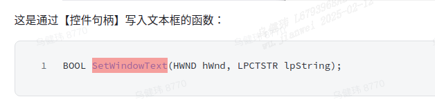

# 记事本


## 基础功能

- 支持文本文件的打开、保存、另存为功能
- 包含状态栏、能够展示文件大小

## 升级功能

1.标题展示文件名

2.支持输入回车

3.支持自动换行

4.支持自动伸缩（响应WM_SIZE信息）

5.支持快捷键，如保存：Ctrl+s

6.状态栏展示更多信息，如第几行、第几列、文件格式等等


首先把对话框配置好 中间一个edit框 下面一个静态文本框 


然后就是把menu做好

在资源文件里把menu做好


#### 打开

就把各种id改一下开始实现各个功能

```c
case ID_MENU_OPEN:
        OpenFile(&npad);
        break;
```

第一个要实现的就是OpenFile(&npad);

一开始是传入的hwnd(窗口句柄)  但由于后面觉得窗口句柄内容不全 就做了个结构体 传入指针

```c
struct NotePad {
    TCHAR FilePath[MAX_PATH];
    HWND hwndDlg;
    HWND hwndEdit;
    HWND hwndStatic;
};
```

然后来实现OpenFile(&npad);

直接用打开的这个函数就好



```c
void OpenFile(struct NotePad *np)
{
    TCHAR path[MAX_PATH] = { 0 };//地址 宽字符
    TCHAR Text[32] = { 0 };//内容
    long fileSize;//文件大小

    OPENFILENAME ofn;//ofn是结构体类型的
    ZeroMemory(&ofn, sizeof(ofn));
    ofn.lStructSize = sizeof(ofn);
    ofn.hwndOwner = np->hwndDlg;//由于传入的是个指针 把这个地方改一下就好
    ofn.lpstrFile = path;
    ofn.nMaxFile = sizeof(path);
    ofn.lpstrFilter = TEXT("txt文本文档\0*.txt\0All\0*.*\0");//文件过滤器 会把其他格式的过滤掉
    if (GetOpenFileName(&ofn)) {
        _tcscpy(np->FilePath, path);//把字符串复制一下 path本来就是宽字符 就不用变了 直接拷贝
        fileSize = LoadFileToEdit(np->FilePath, np->hwndEdit);//再写一个函数 专门处理把文件里的内容传到文本框里 并放回文件大小
        if (fileSize != -1) {
            _stprintf(Text, TEXT("文件大小：%ld 字节"), fileSize);//格式化处理
            SetWindowText(np->hwndStatic, Text);//把文本内容放到静态文本框中
        }
    }
}
```

然后写一下LoadFileToEdit

```c
// 加载文件到编辑框
long LoadFileToEdit(TCHAR* FilePath, HWND hwndEdit)
{
    char file_name[MAX_PATH];//文件的名字 窄字符
    WideCharToMultiByte(CP_ACP, 0, FilePath, -1, file_name, MAX_PATH, NULL, NULL);//把宽字符传进来的文件名字转为窄字符
    FILE* file = fopen(file_name, "rb");//用流打开文件
    if (file == NULL)
    {
        MessageBox(hwndEdit, TEXT("打开文件失败"), TEXT("提示"), MB_ICONEXCLAMATION);
        return -1;
    }

    long fileSize = get_file_size(file);//写一个函数来得到文件大小 并返回文件大小作为这个函数的返回值
    if (fileSize == -1){
        MessageBox(hwndEdit, TEXT("获取文件大小失败"), TEXT("提示"), MB_ICONEXCLAMATION);
        // 关闭文件
        fclose(file);
        return fileSize;
    }
    
    // 读取文件内容到缓冲区
    size_t bytesRead = fread(buffer, 1, fileSize, file);//将文件内容给到buffer

    MultiByteToWideChar(CP_ACP, 0, buffer, -1, wBuffer, bytesRead);//由于文件内容是窄字符 要给到edit需要宽字符就需要转换
    // 将文件内容加载到编辑框
    SetWindowText(hwndEdit, wBuffer);//把宽字符的文件内容给到edit文本框

    // 关闭文件
    fclose(file);
    
    return fileSize;//返回值为文件大小 之后可以给静态文本框使用
}
```

然后实现一下


```c
long get_file_size(FILE *file) 
{
    long size = -1;  // 默认值，表示获取文件大小失败

    if (file != NULL) {
        // 获取当前文件位置
        long currentPosition = ftell(file);

        if (currentPosition != -1) {
            // 移动文件位置指针到文件末尾
            if (fseek(file, 0, SEEK_END) == 0) {
                // 获取文件末尾的位置，即文件大小
                size = ftell(file);
            }

            // 恢复文件位置指针到原来的位置
            fseek(file, currentPosition, SEEK_SET);//SEEK_SET 文件其实位置
        }
    }

    return size;
}
```


第一个打开文件的功能就实现了

然后来实现保存的功能

```c
    case ID_MENU_SAVE:
        SaveFile(&npad);
        break;
```

设计了一个从edit文本框保存到文件的函数

```c
void SaveFile(struct NotePad *np)
{
    SaveEditToFile(np->hwndEdit, np->FilePath);
}
```

把文本框里的内容 传到buufer上 再传到文件里

```c
void SaveEditToFile(HWND hwndEdit, TCHAR* FilePath)
{
    // 获取编辑框中的文本内容
    GetWindowText(hwndEdit, wBuffer, sizeof(wBuffer));//把编辑框内容给到wBuffer wBuffer是宽字符 文本框里的也是宽字符
    int used_buffer_size = WideCharToMultiByte(CP_ACP, 0, wBuffer, -1, buffer, sizeof(buffer), NULL, NULL);//把wBuffer转为窄字节的buffer 并且把文件大小返回给used_buffer_size

    char file_name[MAX_PATH];//窄字符的文件名
    WideCharToMultiByte(CP_ACP, 0, FilePath, -1, file_name, MAX_PATH, NULL, NULL);//把宽字节的FilePath转为file_name
    FILE* file = fopen(file_name, "wb");//可写 打开流
    if (file == NULL)//打开失败
    {
        MessageBox(hwndEdit, TEXT("打开文件失败"), TEXT("提示"), MB_ICONEXCLAMATION);
        return ;
    }
    
    //写入字符串的长度，不包含结尾的 null 字符
    fwrite(buffer, sizeof(char), used_buffer_size - 1, file);//将buffer写入文件中

    // 关闭文件
    fclose(file);
}
```

#### 另存为

然后再来实现另存为

```c
    case ID_MENU_SAVE_AS:
        SaveAsFile(&npad);
        break;
```

首先 直接用这个 然后在最后做点修改


```c
void SaveAsFile(struct NotePad *np)
{
    TCHAR path[MAX_PATH] = { 0 };

    OPENFILENAME ofn;
    ZeroMemory(&ofn, sizeof(ofn));
    ofn.lStructSize = sizeof(ofn);
    ofn.hwndOwner = np->hwndDlg;
    ofn.lpstrFile = path;
    ofn.nMaxFile = sizeof(path);
    ofn.lpstrFilter = TEXT("txt文本文档\0*.txt\0");//文件过滤器

    if (GetSaveFileName(&ofn))
    {
        _tcscat(path, TEXT(".txt"));//自动加上文件格式
        SaveEditToFile(np->hwndEdit, path);//调用之前写的把文本框内容保存到文件里
    }
}
```

#### 退出

然后实现退出的功能 这个最简单

```c
    case ID_MENU_QUIT:
        EndDialog(hwndDlg, 0);
        break;
```

#### 关于

然后实现关于

```c
    case ID_MENU_ABOUT:
        ShowVersion(hwndDlg);
        break;
```

在ShowVersion函数里实现一下版本信息的更新

```c
void ShowVersion(HWND hwndDlg)
{
    MessageBox(hwndDlg, TEXT(" \
作品更新历史:\n \
<--------------------------------------------------------->\n \
V1.0\n \
首个版本，实现了文本文件的打开、保存、另存为功能，能够展示文件大小 \
"), TEXT("版本号V1.0"), MB_OK);
}
```


